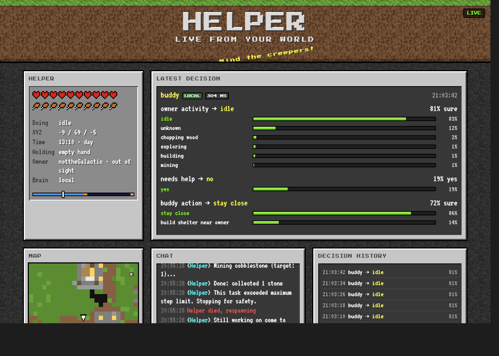
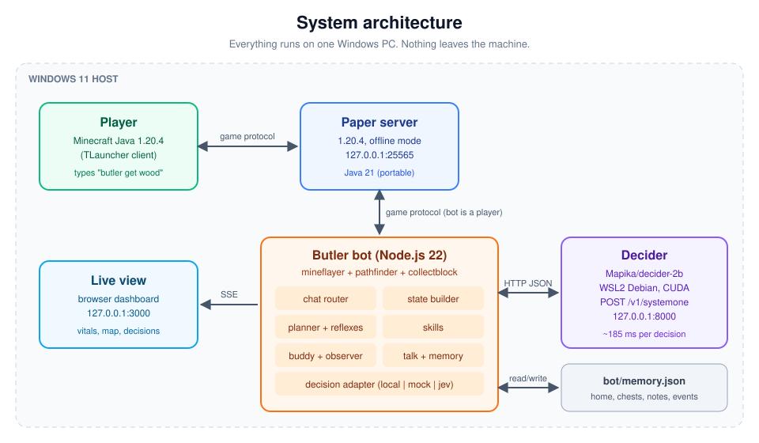
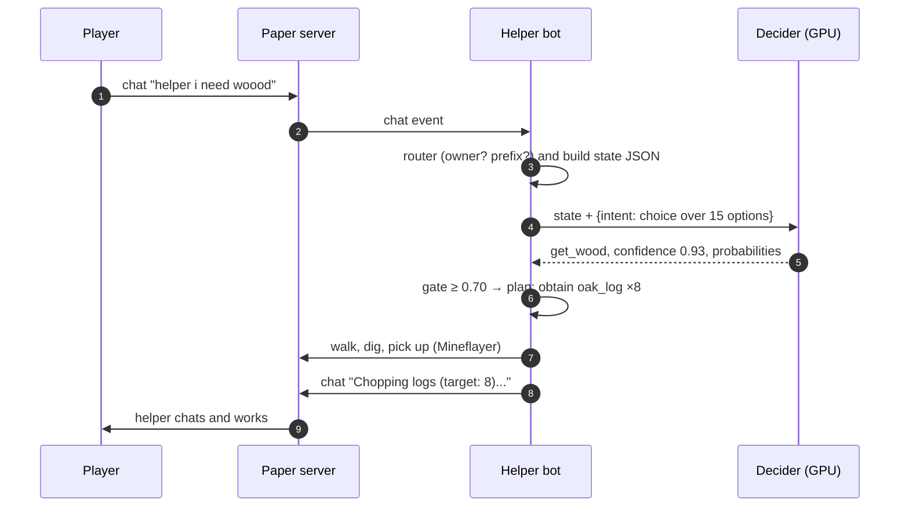
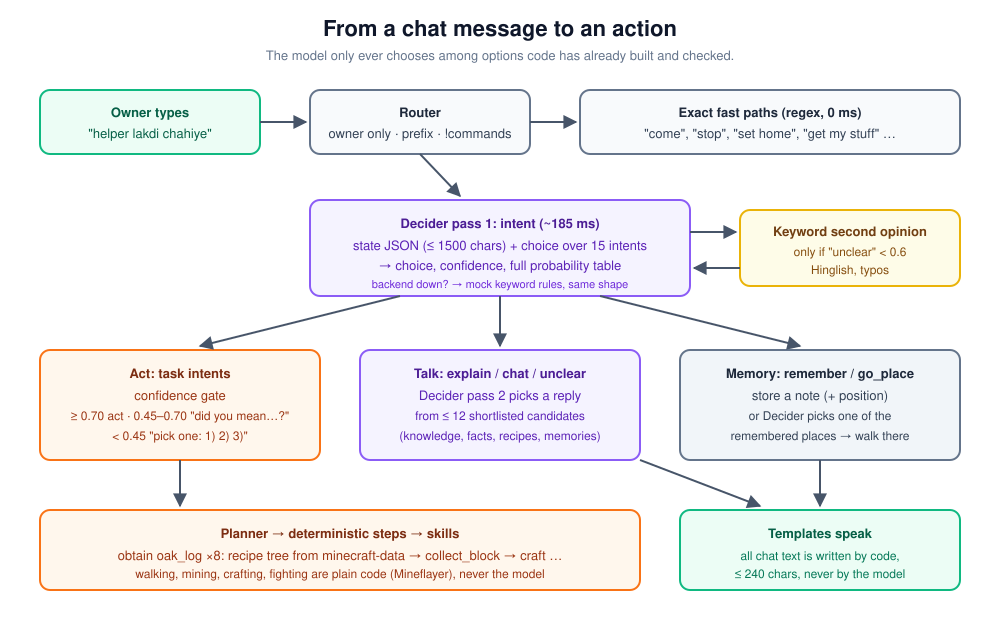
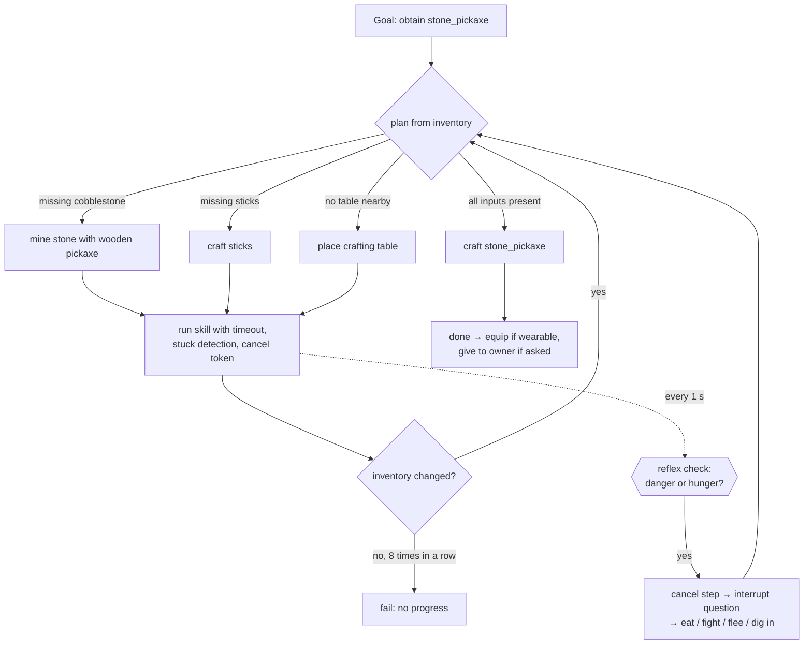
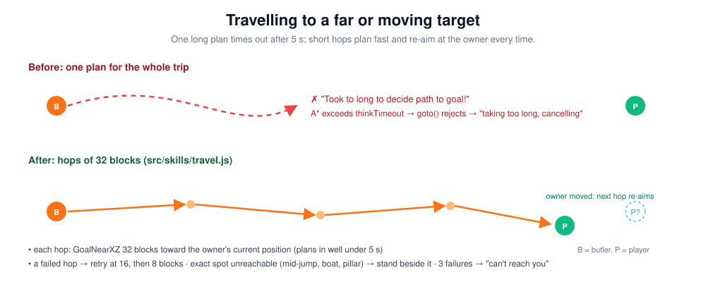
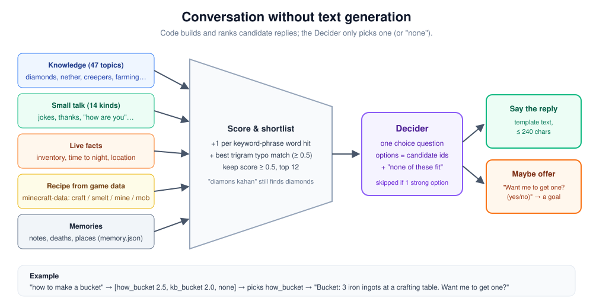
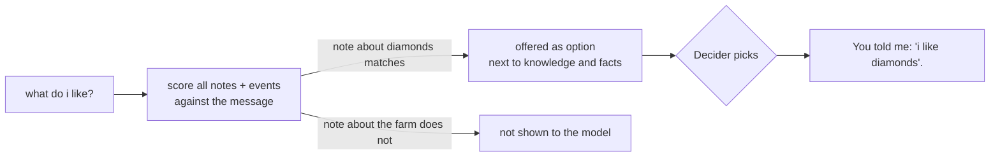
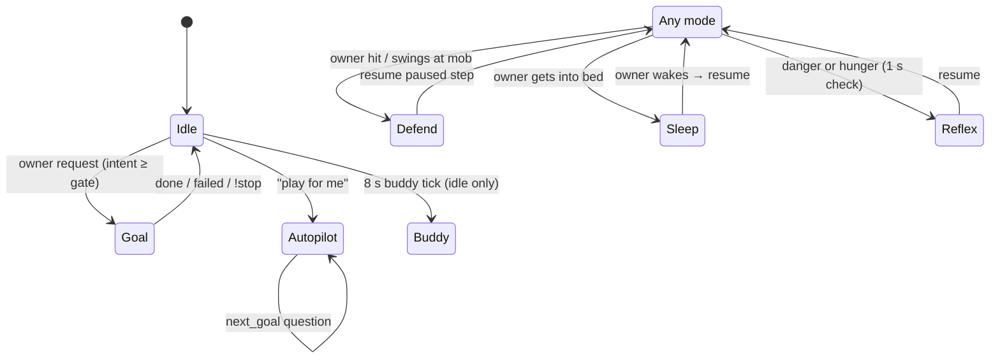

# Minecraft Helper: a System-1 companion for Minecraft

A Minecraft companion bot that plays **with** you. It gathers, crafts, fights, protects you, sleeps when you sleep, fetches your items after you die, remembers places, and chats in English and Hinglish. Every decision comes from a small, fast, **calibrated classifier** (the *Decider*) choosing among options that code has already checked. There is no chat LLM and no cloud API, and a decision takes about 185 ms on a laptop GPU.

<p align="center">
  
  <br><em>The live view at <code>http://127.0.0.1:3000</code> showing a real buddy-mode decision. The Decider judged the owner "idle" (83 %) and chose to "stay close" (86 %).</em>
</p>

---

## Contents

- [What it can do](#what-it-can-do)
- [Quick start (no GPU needed)](#quick-start-no-gpu-needed)
- [Full installation](#full-installation)
- [Configuration](#configuration)
- [Running it](#running-it)
- [Talking to the helper](#talking-to-the-helper)
- [Testing and evaluation](#testing-and-evaluation)
- [Troubleshooting](#troubleshooting)
- [Technical report: how it works](#technical-report-how-it-works)
- [Project layout](#project-layout)

---

## What it can do

| Area | What the helper does |
|---|---|
| **Get anything** | "get 10 iron", "make me a bucket", "i need torches". It plans the full recipe tree from game data: chop, mine, smelt, craft. |
| **Build** | "build a hut" / "build a big house" from JSON blueprints (`hut_5x5`, `hut_7x7`). |
| **Autopilot** | "play for me": it picks goals by itself (wood → tools → food → shelter at night → iron gear → diamond gear). |
| **Fight** | Sword with a **shield** (blocks between swings, faces creepers so the shield absorbs the blast), **bow** against skeletons. It heals by eating and never runs from a fight it can win. |
| **Protect you** | Jumps in the moment you are hit or swing at a mob, then resumes what it was doing. It targets the mob that actually hit you. |
| **Buddy mode** | Watches what you do: mines what you're mining, brings the blocks you build with, gives food when you're hurt, arrows when you hold a bow, torches at night. |
| **Sleep** | Gets into bed when you do (a free bed nearby, or its own from its kit), so the night actually skips. |
| **Death recovery** | Recognises all 97 vanilla death messages, marks where you died, and "get my stuff" walks there, picks your items up and hands back only those. |
| **Memory** | "set home", "go home", "remember my farm is here", "take me to the farm", "what do I like?", "where did I die?". It survives restarts. |
| **Conversation** | Answers Minecraft questions (47 topics), gives recipes read from game data, small talk and jokes, and live facts ("what time is it?"), all chosen by the Decider. The text itself is written in advance by code. |
| **Starter kit** | Wooden tools, shield, bow and arrows, leather armor, a bed and bread, topped up automatically (a local server with `/give` rights). |

---

## Quick start (no GPU needed)

The bot runs with a keyword-rule **mock** backend, so you can try everything before setting up the Decider.

```powershell
# 1. Minecraft server (Paper 1.20.4) — see "Full installation" §2 for the one-time setup
server\start.bat

# 2. Configure
copy .env.example .env      # then set OWNER_NAME to your exact in-game name

# 3. Bot
cd bot
npm install
npm start                   # joins as "Helper"; live view at http://127.0.0.1:3000
```

Join `127.0.0.1` from Minecraft Java **1.20.4** and type `helper get wood` in chat.

---

## Full installation

Tested on Windows 11 with an RTX 4060 Laptop GPU (8 GB VRAM) and 32 GB RAM. The Decider needs about 4 GB of VRAM. Everything else runs on the CPU.

### Requirements

| Component | Version | Needed for |
|---|---|---|
| Minecraft Java Edition (e.g. TLauncher) | **1.20.4** | you, the player |
| Java (Eclipse Temurin JDK) | **21**, portable zip | the Paper server |
| Paper | **1.20.4** (latest build) | the local server |
| Node.js | **22.x** | the bot |
| WSL2 (Debian) + NVIDIA GPU | Python 3.11, CUDA via the Windows driver | the Decider (optional; mock works without) |

> **Why 1.20.4?** It is the last version before the 1.20.5 item-component rewrite, which broke many bot libraries. `mineflayer-pathfinder` was last released in the 1.20 era.

### 1. Java 21 (portable, leaves your PATH alone)

Download the **Temurin 21 JDK, Windows x64, .zip** from [adoptium.net](https://adoptium.net/temurin/releases/?version=21&os=windows&arch=x64&package=jdk). Extract it so that `tools\jdk-21\bin\java.exe` exists.

```powershell
& ".\tools\jdk-21\bin\java.exe" -version   # openjdk version "21..."
```

### 2. Paper server

1. Download the latest **1.20.4** build from [papermc.io](https://papermc.io/downloads/all) and save it as `server\paper-1.20.4.jar`.
2. Run `server\start.bat` once, then set `eula=true` in `server\eula.txt` (you accept Mojang's EULA).
3. Copy `server\server.properties.template` over `server\server.properties`. The important keys are:

   ```properties
   server-ip=127.0.0.1          # only this PC can connect: offline mode must never be exposed
   online-mode=false            # TLauncher and the bot use offline accounts
   enforce-secure-profile=false # otherwise 1.19+ chat signing breaks for offline players
   white-list=true
   spawn-protection=0           # otherwise the bot can't build near spawn
   allow-flight=true            # stops kicks when pathfinding jumps oddly
   ```
4. Start the server again, then in its console run:
   ```
   whitelist add <YourName>
   whitelist add Helper
   op <YourName>
   op Helper            # the starter kit uses /give
   ```

### 3. The bot

```powershell
copy .env.example .env
notepad .env          # OWNER_NAME=<YourName>, exactly as in the launcher (case-sensitive)
cd bot
npm install
```

### 4. The Decider (optional, recommended)

Inside **WSL2 Debian** (the GPU comes from the Windows driver, so don't install NVIDIA drivers inside WSL):

```bash
nvidia-smi                                   # must list your GPU
bash /mnt/c/<path-to-repo>/decider-server/setup_wsl.sh   # venv, decider-ai[serve]==1.5.0, downloads Mapika/decider-2b
                                             # must print: cuda True
bash /mnt/c/<path-to-repo>/decider-server/start_wsl.sh   # serves http://127.0.0.1:8000 — leave it running
```

Check it from Windows with `decider-server\smoke_test.ps1`. The second call should take under ~500 ms. Then set `DECISION_BACKEND=local` in `.env`.

> If VRAM is tight, set `DECIDER_MODEL=Mapika/decider-0.8b` before `start_wsl.sh`. No code change is needed.

---

## Configuration

All settings live in `.env` at the repository root.

| Key | Default | Meaning |
|---|---|---|
| `OWNER_NAME` | — (required) | Your in-game name. The helper only obeys this player. |
| `BOT_USERNAME` | `Helper` | The bot's name |
| `MC_HOST` / `MC_PORT` / `MC_VERSION` | `127.0.0.1` / `25565` / `1.20.4` | Server address |
| `CHAT_PREFIXES` | `helper,!,@helper` | How you address the helper |
| `DECISION_BACKEND` | `mock` | `local` (WSL Decider), `mock` (keyword rules), `jev` (hosted API) |
| `DECISION_TIMEOUT_MS` | `4000` | Per decision. On timeout it falls back to mock. |
| `CONF_ACT` / `CONF_ASK` | `0.70` / `0.45` | Confidence gate: act / ask "did you mean…?" / offer a pick list |
| `LOCAL_BASE_URL` | `http://127.0.0.1:8000` | Decider address |
| `AUTO_KIT` | on | Set `false` to disable the starter kit |
| `WEB_PORT` | `3000` | Live view |
| `LOG_DIR` / `LOG_DECISIONS` | `../logs` / `true` | Logs, and a JSONL record of every decision (used by evaluation) |
| `MEMORY_FILE` | `bot/memory.json` | Where memories are stored |

---

## Running it

Start these in order, each in its own terminal:

```text
1. server\start.bat                              Paper server
2. (WSL)  decider-server/start_wsl.sh            Decider, if DECISION_BACKEND=local
3. cd bot && npm start                           the helper joins the world
4. open http://127.0.0.1:3000                    live view (optional)
```

> **After changing any code, restart step 3.** Node does not reload files: a running helper keeps the code it started with.

---

## Talking to the helper

Start a message with `helper` (or end it with `helper`), or use a `!command`. Only `OWNER_NAME` is obeyed.

### Commands

| Command | Does |
|---|---|
| `!help` | List commands |
| `!stop` | Stop immediately |
| `!come` / `!follow` | Walk to you / follow you |
| `!give` | Hand you its items |
| `!auto` | Autopilot |
| `!status` | Health, food, time, current task |
| `!why` | Explain the last decision (choice, confidence, top alternatives) |
| `!buddy` | Toggle buddy mode (on by default) |
| `!kit` | Restock the starter kit now |
| `!sethome` / `!home` | Remember this spot as home / go home |
| `!stuff` | Fetch the items you dropped when you died |
| `!where` | Home, chests and where you last died |
| `yes` / `no` / `1` `2` `3` | Answer the helper's questions |

### Things you can just say

```text
helper get wood                    helper lakdi chahiye
helper make me a stone pickaxe     helper get 10 iron
helper build a hut                 helper kill that zombie
helper play for me                 helper follow me
helper how do i find diamonds      helper how to make a bucket
helper tell me a joke              helper what time is it
helper remember my farm is here    helper take me to the farm
helper set home                    helper get my stuff
helper what do i like              helper forget the farm
```

---

## Testing and evaluation

```powershell
cd bot
npm test          # 159 unit tests (node --test, no extra dependencies)
npm run eval      # runs 175 labelled chat lines through the configured backend
```

`npm run eval` prints accuracy per intent, p50/p95 latency, a confidence-threshold sweep, recommended `CONF_ACT`/`CONF_ASK` values and every confusion. It saves a report to `bot/logs/eval-<backend>-<date>.json`. See [§11 Evaluation](#11-evaluation) for the current numbers.

---

## Troubleshooting

| Symptom | Cause and fix |
|---|---|
| A new feature doesn't work | The running bot predates the change. Stop it with Ctrl+C and run `npm start` again. |
| `Config error: OWNER_NAME is missing` | Set `OWNER_NAME` in the root `.env`. |
| The helper ignores you | `OWNER_NAME` must match your name exactly, including case. Start messages with `helper`. |
| The helper can't break or place near spawn | `spawn-protection=0` in `server.properties` |
| No starter kit | The helper needs op for `/give`: run `op Helper` in the server console. |
| Chat messages vanish or you get kicked for chat | `enforce-secure-profile=false` |
| "Decision backend (local) failed, falling back to mock" | The Decider isn't running, or WSL networking is down. Check `curl localhost:8000/health` inside WSL and `smoke_test.ps1` from Windows. |
| The helper doesn't sleep | Monsters within about 8 blocks block sleeping, for the helper just like for you. |
| "I can't reach you" | Your spot is unreachable (walled in, water, far up). Come closer, or `!stop`. |

---

## Technical report: how it works

### Abstract

We present a Minecraft companion agent whose every judgement (what the player wants, whether to interrupt a task, what to do next, how to help, what to reply) is made by a 2-billion-parameter **Decider** model. The model answers typed questions (`choice`, `score`, `noul`) with calibrated probabilities instead of generating text. The central design rule is that **the model only chooses among options code has already built and verified to be possible**. It never outputs coordinates, item names or free text. Planning, navigation, combat and all chat text are deterministic code. Every decision takes one ~185 ms forward pass on a laptop GPU, and a keyword-rule fallback keeps the agent working without the model. The agent covers open-ended item acquisition, building, autopilot survival, combat with shield and bow, companion behaviour, sleeping, death recovery, persistent memory and conversation. On a 175-message intent set covering English, Hinglish and typos, the model alone reaches 74.9 % accuracy. A zero-latency keyword second opinion on low-confidence "unclear" answers brings this to an estimated 88 %. At a confidence threshold of 0.70, the model acts on 47 % of messages at 96 % accuracy and asks for clarification on the rest.

### 1. Introduction

New Minecraft players get stuck on the same problems: no wood, no tools, no food, dying on the first night. A companion that helps must understand casual, misspelt, code-switched chat ("lakdi chahiye", "gt wod") and react in real time: a creeper does not wait for a multi-second LLM call. General-purpose LLM agents for Minecraft, such as Voyager [1], show impressive open-ended skill, but they depend on large hosted models and take seconds per step. A generative model can also state a wrong recipe with confidence, and a beginner cannot catch it.

This project takes the opposite position, loosely following Kahneman's *System 1 / System 2* distinction [2]. Most in-game judgement is fast, intuitive classification ("is this a request for wood?", "fight or flee?"). That kind of judgement fits a small model that returns a probability distribution over options. The slow, deliberate part (a recipe tree, a path, a build) is better done by plain code that is correct by construction.

**Contributions.**
1. An agent architecture in which a calibrated classifier makes every decision and code guarantees every action is legal.
2. Conversation, including question answering and memory recall, **without text generation**: code shortlists candidate replies and the classifier picks one.
3. Memory access decided by the model without growing its context: memories enter the question only as options, and only when relevant.
4. Robustness mechanisms: a confidence gate, graceful fallbacks, legality filtering that keeps bad choices off the menu, and hop-based long-distance navigation.

### 2. Design principles

1. **The model chooses; code proposes and executes.** Every question the model sees lists only legal options: `fight` only when fighting is winnable, `eat_food` only with food in the inventory.
2. **Never generate text.** All chat comes from templates (≤ 240 characters), so it is always correct and never off-brand.
3. **Deterministic where possible.** Recipes come from `minecraft-data`, paths from A* [3], and fights follow fixed routines.
4. **Degrade gracefully.** Backend down → keyword mock. Low confidence → ask. One option → skip the model.
5. **Local only.** No cloud calls. The server binds to `127.0.0.1`.

### 3. System architecture

<p align="center"></p>

Four processes run on one PC. The player's client and the bot both connect to a local Paper server. To the server, the bot is simply another player, driven by [Mineflayer](https://github.com/PrismarineJS/mineflayer) with the pathfinder and collect-block plugins. The bot sends decisions to the Decider over HTTP (`POST /v1/systemone`) and streams its state to a browser dashboard over Server-Sent Events.



### 4. The decision layer

**Question types.** The Decider answers three kinds of typed question in one pass:

| Type | Answer | Used for |
|---|---|---|
| `choice` | one option id, confidence, full probability table | intent, interrupt, next goal, buddy action, reply, place |
| `noul` | probability that a statement is true | "wants to learn?", "owner needs help?" |
| `score` | one level on an ordered scale | item amount ("one / a few / a stack") |

Each option has a short 3–15-word description. The small model relies on those descriptions heavily, so option ids are stable and descriptions are tuned like prompts.

**The five decision points.**

| Question | When asked | Options (filtered by legality) |
|---|---|---|
| `intent` | the owner chats | 15 intents: get_wood, make_tools, get_food, survive_night, follow_me, come_here, give_items, autopilot, explain, chat, remember, go_place, stop, status, unclear |
| `interrupt` | danger or hunger mid-task (checked every 1 s) | continue_task, eat_food, fight, flee, dig_in, get_food |
| `next_goal` | autopilot finished a goal | get_wood, make_tools, get_food, survive_night, progress |
| `buddy_action` | every 8 s in buddy mode | stay_close, protect_owner, gather_same, bring_materials, give_food, build_shelter_near_owner, scout_ahead, continue_own_task |
| `answer` | a question or small talk | ≤ 12 shortlisted replies + `none` (§8) |

**Confidence gate.** The calibrated confidence decides how the helper responds:

| Top-1 confidence | Behaviour |
|---|---|
| ≥ `CONF_ACT` (0.70) | act |
| 0.45 – 0.70 | "Did you mean: make tools? (yes/no)" |
| < 0.45 | "Pick one: 1) get wood 2) get food 3) make tools" |

<p align="center"></p>

**Legality filtering beats instruction.** Early play-testing showed a failure mode: with `flee` always on the interrupt menu, the model sometimes chose to run from a lone zombie even though the helper was healthy and armed. Rather than tune descriptions, `flee` is now only offered when fighting is not a sure thing: the helper is hurt, the mob is a creeper and it has no shield, or it is outnumbered. The general lesson is to **shape the option set, not the model**.

**Fallbacks.** If the backend errors or times out (4 s), the mock backend answers the same question with keyword rules and the same response shape. If the model answers `unclear` with confidence below 0.6, the keyword rules get a second opinion. They know Hinglish and common typos ("idhar aao" → come_here, "ruko" → stop) but defer to any confident model answer and ignore prompt-injection text.

### 5. State representation

Each decision carries a compact JSON snapshot of the world, capped at **1500 characters** so the pass stays fast. Keys are always in a fixed order:

```json
{ "purpose": "intent", "player_message": "i need woood",
  "time_of_day": "day", "health": 20, "food": 18, "y_level": 64, "in_water": false,
  "inventory": { "oak_log": 3, "bread": 5 },
  "tools": { "pickaxe": "wooden", "axe": "none", "sword": "stone", "shield": true, "bow": true },
  "nearby": { "trees_within_32": 14, "stone_within_16": true, "passive_food_mobs": ["cow"],
              "hostile_mobs": [{ "type": "zombie", "distance": 6 }], "owner_distance": 3 },
  "current_goal": "none", "current_step": "none", "last_step_result": "none", "autopilot": false }
```

Memories are deliberately **not** part of the state (§9).

### 6. Planning and skills

**Goals → steps → skills.** A goal is either a fixed recipe (`make_tools`, `survive_night`) or a generated one:

- `obtain:<item>:<n>` is planned recursively from `minecraft-data`. For each missing input it chooses **craft** (the recipe tree), **smelt** (a table of furnace recipes), **mine** (a block that drops the item, plus the cheapest tool that can harvest it) or **hunt** (a mob that drops it).
- `blueprint:<id>` gathers the materials, then places blocks from JSON.
- `mob:<name>` fights a mob type.
- `goto:x,y,z` walks to a position.



The plan is recomputed after every step from the current inventory, so it naturally absorbs lucky drops, lost items and interruptions. Progress is measured as *inventory changed*: a timed-out step that still collected 5 of 8 logs counts as progress. Eight steps in a row with no change ends the goal.

**Skills** are plain Mineflayer routines with a common contract: `run(bot, ctx, cancelToken, args)` returns `{ ok, reason, message }`. A wrapper adds a timeout, a stuck detector (no movement for 15 s while pathing) and cleanup on cancellation. They include `collect_block`, `craft`, `smelt`, `place_block`, `hunt`, `fight`, `flee`, `dig_in`, `eat`, `explore`, `build_blueprint`, `come_to_owner`, `follow_owner`, `give_to_owner`, `go_to`, `recover_items` and `sleep_with_owner`.

**Safe movement.** No parkour. It never breaks chests, barrels, furnaces or crafting tables, nor white/red beds and oak doors (others are not yet protected). It won't dig blocks it lacks the tool for (no punching stone), avoids lava, fire, magma and cacti, and drops at most 3 blocks.

**Navigation in hops.** `pathfinder.goto()` rejects a goal if planning exceeds its 5 s budget, which long or twisty trips hit even when a usable partial route exists. Long trips therefore travel in hops:

<p align="center"></p>

### 7. Reflexes, combat and safety

Hard safety rules run **before** the model and cannot be vetoed: standing in lava or on fire → flee; a creeper within 4 blocks without a usable shield → flee; health ≤ 4 with a hostile within 8 → flee. Every second, a reflex check can cancel a long step (chopping, mining) when danger or hunger appears, then ask the `interrupt` question with only legal options.

**Combat routine.** The helper equips its best sword and keeps a **shield** raised between swings. A shield only blocks what it faces, so it keeps looking at the target, which includes absorbing a creeper blast from the front. It lowers the shield just to swing, with a 600 ms cooldown. Against skeletons, strays and pillagers more than 6 blocks away it switches to the **bow**. It aims at the target's upper body plus an allowance for arrow drop (about 0.003·d² blocks at full draw) and draws for 1.1 s. It leaves a fight at health ≤ 8, then flees or eats. When hurt, eating tops the food bar up to full, since full food plus saturation is what regenerates health.

### 8. Buddy mode and conversation

**Observing the owner.** The observer tracks what the owner broke and placed near them, their movement and damage over a 20-second window, hostile mobs near them, what they are holding, and their deaths. From this, the Decider classifies the owner's activity (`chopping_wood`, `mining`, `building`, `fighting`, `exploring`, `idle`) and chooses a buddy action from the legal ones.

**Defending the owner is event-driven, not polled.** Minecraft does not report who dealt damage, so the attacker is inferred: the nearest melee mob within 4 blocks of the owner, otherwise the nearest ranged mob within 20. When the owner is hurt, or **swings at a hostile mob within 4 blocks**, the planner pauses whatever step is running (even following), fights, then resumes the paused goal. This needs no model call, since someone hitting the owner is not a judgement call.

**Sleeping together.** The helper counts as a player, so the night only skips if it sleeps too. When the owner gets into bed (the `entitySleep` event from the pose metadata), the helper walks over, uses a free bed nearby or places the one from its kit, sleeps until the owner wakes, then picks its bed up and resumes its previous goal.

**Conversation without generation.** For questions and small talk, code assembles candidate replies from five sources. Each candidate is scored by keyword-phrase hits plus the best character-trigram similarity between any message word and a keyword (so "diamons" still matches "diamonds"). At most 12 are shortlisted, and the Decider picks one or `none`.

<p align="center"></p>

Recipe answers are computed, never written by hand: "Bucket: 3 iron ingots at a crafting table." comes straight from `minecraft-data`, followed by an offer ("Want me to get one? (yes/no)") that turns into an `obtain` goal. The knowledge base (47 topics) is data in `bot/src/chat/knowledge.js`, so adding a topic changes no code and no model.

### 9. Memory

`bot/memory.json` persists places (home, the last death spot, up to 20 chests), notes the player asked it to remember (with the player's position when they say "here"), and events (deaths). The key design choice is that **memories never enter the model's state**, which is capped at 1500 characters. A memory reaches the model only as an answer option, and only when it matches the message. The model then decides whether it answers the question:



This lets memory grow without growing the context, and keeps the model in charge of whether a memory is relevant.

**Death detection** matches every vanilla death-message template from `minecraft-data` (97 for 1.20.4), with the owner's name placed in the victim slot. Chat such as "&lt;Alice&gt; I hit the ground lol", other players' deaths and deaths the owner *caused* are rejected. The entity death status is a second signal that still works when death messages are turned off, and each death is counted once.

### 10. Mode and control structure



| Loop | Period | Purpose |
|---|---|---|
| Reflex check | 1 s | danger or hunger → cancel step → `interrupt` |
| Interrupt check between steps | ≥ 2 s | same question at step boundaries |
| Buddy tick | 8 s | `owner_activity` + `buddy_action` when idle |
| Owner events | immediate | hurt / swing → defend; sleep → sleep; death → mark spot |
| Kit top-up | 20 s | `/give` missing kit items, equip armor and shield |
| Live view | 0.5 s | state snapshot over SSE |

### 11. Evaluation

**Setup.** 175 labelled owner messages across 15 intents. They include English, Hinglish ("mere paas aao", "raat se bachao"), typos ("gt wod"), small talk, memory commands and prompt-injection attempts. Backend: `Mapika/decider-2b` on an RTX 4060 Laptop GPU in WSL2.

**Accuracy and latency** (model alone, no fallback):

| Metric | Value |
|---|---|
| Overall accuracy | **131 / 175 (74.9 %)** |
| Latency p50 / p95 | 187 ms / 205 ms |
| With the keyword second opinion on low-confidence `unclear` | **≈ 88 %** (fixes 25 of 44 errors, can flip at most 2 correct lines; estimated from the confusion list) |

| Intent | Acc. | Intent | Acc. | Intent | Acc. |
|---|---|---|---|---|---|
| make_tools | 12/12 | remember | 8/8 | chat | 14/16 |
| get_food | 10/12 | survive_night | 10/12 | stop | 9/11 |
| status | 8/10 | go_place | 6/8 | follow_me | 8/11 |
| unclear | 10/14 | explain | 11/16 | get_wood | 8/12 |
| come_here | 6/11 | autopilot | 6/11 | give_items | 5/11 |

**Calibration.** Because confidences are calibrated [4], a single threshold trades coverage for precision:

| Threshold | % acted on | Accuracy when acting |
|---|---|---|
| 0.50 | 64.6 % | 85.8 % |
| 0.60 | 54.9 % | 90.6 % |
| **0.70 (default)** | **47.4 %** | **96.4 %** |
| 0.85 | 28.6 % | 98.0 % |

At the default gate, a wrong action is rare. Most uncertain messages turn into a quick "did you mean…?" rather than a mistake.

**Error analysis.** Most remaining errors are Hinglish or typo-heavy messages classified as a low-confidence `unclear`, which the keyword second opinion largely recovers. The rest are confusions between near-neighbours: "give me the food" → `get_food` (92 %) instead of `give_items`, and "how do i make planks" → `get_wood`. These are candidates for description tuning.

**Unit tests.** 159 tests cover the parts that are pure code: the planner, heuristics and legality, the state builder, the decision adapter and validation, skills against a fake bot, combat choices, talk ranking, memory, death-message matching, hop travel, defending the owner and the sleep routine.

### 12. Limitations

- **Attacker attribution is a heuristic.** Minecraft does not say who dealt damage.
- **Bow aim does not lead moving targets.**
- **One memory file per installation.** Playing several worlds mixes their places.
- **Conversation is bounded by its candidates.** Questions outside the knowledge base, facts and recipes get an honest "I didn't understand that".
- **The starter kit relies on `/give`**, so the bot needs operator rights on a local server.
- Single owner, local server, Minecraft 1.20.4 only.

### 13. Future work

- Tune option descriptions for the weakest intents (`give_items`, `come_here`, `autopilot`) using the eval set.
- Learn from play: every decision is logged (`logs/decisions.jsonl`), and heuristic-vs-model disagreements show where each is better.
- Reactions and personality on events (first diamond, near-death), plus challenges and achievements on the live view.
- A per-world memory key and lead-aiming for the bow.

### References

1. G. Wang et al. *Voyager: An Open-Ended Embodied Agent with Large Language Models.* 2023.
2. D. Kahneman. *Thinking, Fast and Slow.* Farrar, Straus and Giroux, 2011.
3. P. E. Hart, N. J. Nilsson, B. Raphael. *A Formal Basis for the Heuristic Determination of Minimum Cost Paths.* IEEE Trans. SSC, 1968.
4. C. Guo, G. Pleiss, Y. Sun, K. Q. Weinberger. *On Calibration of Modern Neural Networks.* ICML, 2017.
5. PrismarineJS. *Mineflayer*, *mineflayer-pathfinder*, *minecraft-data*. https://github.com/PrismarineJS

---

## Project layout

```text
.
├── .env.example                  configuration template (copy to .env)
├── IMPLEMENTATION_GUIDE.md       full build guide, locked decisions, phase-by-phase spec
├── docs/images/                  diagrams and screenshot used in this README
├── server/                       Paper 1.20.4 (start.bat, server.properties.template)
├── decider-server/               WSL setup, start and smoke-test scripts for the Decider
├── scripts/eval_intents.js       intent evaluation harness (npm run eval)
└── bot/
    ├── blueprints/               hut_5x5.json, hut_7x7.json
    ├── web/index.html            live view
    ├── test/                     159 unit tests + fixtures (chat_intents.jsonl eval set)
    └── src/
        ├── index.js              wiring: connect, route chat, start loops
        ├── config.js  memory.js  web.js  liveState.js  log.js  cancel.js
        ├── decision/             Decider client, validation, mock backend, question builders
        ├── state/                state JSON builder, world helpers
        ├── planner/              goal loop, reflexes, heuristics, obtain planner, smelting, blueprints
        ├── skills/               every in-game action (fight, travel, sleep, places, …)
        ├── buddy/                owner observer, buddy decisions, defend, gifts
        ├── chat/                 router, throttled output, templates, knowledge base, talk
        └── safety/               safe movement rules, starter kit
```
